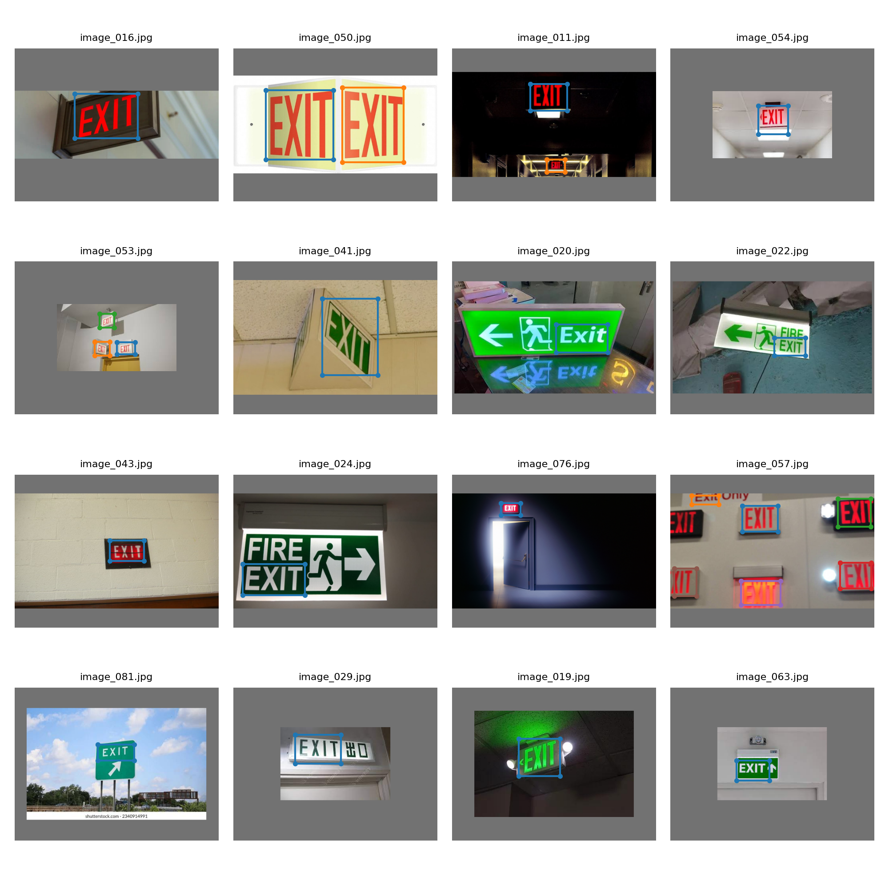
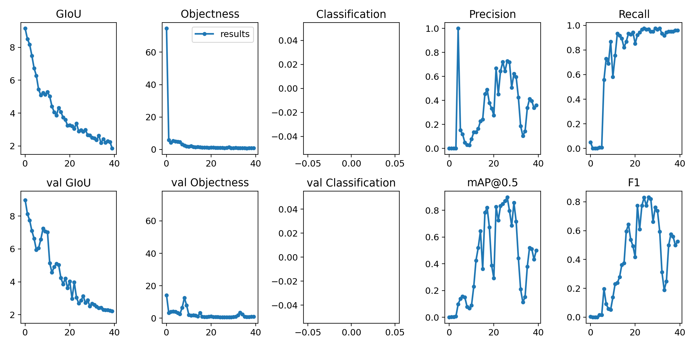

# Session 12 Assignment

## Problem Statement

1. Look at this repo: https://github.com/theschoolofai/YoloV3Links to an external site.
2. You're going to retrain the model on your selection images
3. Select 100 images of your choice
4. Use the annotationLinks to an external site. tool. You're going to use this to annotate your images
5. Once trained to "your" acceptable accuracy, upload:
6. Link to your GitHub repo
7. Link to your README where you need to:
	show the training log
	show YOLOV3 output for 10 images
YoloV3 Simplified for training on Colab with custom dataset.  

_A Collage of **YOLOV3 output**

The **training metrics** :    
