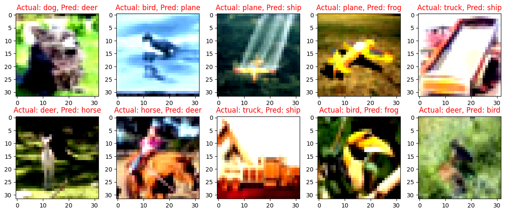

# Session 13 Assignment

## Problem Statement

1. Move the S11 reference assignment code shared above to Lightning first and then to Spaces such that:  
	1.(You have retrained your model on Lightning)  
	2.You are using Gradio  
	3.Your spaces app has these features:  
	&nbsp;&nbsp;&nbsp;&nbsp;	1.ask the user whether he/she wants to see GradCAM images and how many, and from which layer, allow opacity change as well  
	&nbsp;&nbsp;&nbsp;&nbsp;	2.ask whether he/she wants to view misclassified images, and how many  
	&nbsp;&nbsp;&nbsp;&nbsp;	3.allow users to upload new images, as well as provide 10 example images  
	&nbsp;&nbsp;&nbsp;&nbsp;	4.ask how many top classes are to be shown (make sure the user cannot enter more than 10)  
	4.Add the full details on what your App is doing to Spaces README   

2. Head over to submissions and then:  
&nbsp;&nbsp;&nbsp;&nbsp;	1.Submit the Spaces App Link  
&nbsp;&nbsp;&nbsp;&nbsp;	2.Submit the Spaces README link (Space must not have training code)    
&nbsp;&nbsp;&nbsp;&nbsp;	3.Submit the GitHub Link where Lightning Code can be found along with detailed README with log, loss function graphs, and 10 misclassified images

The **10 misclassified images** :   

