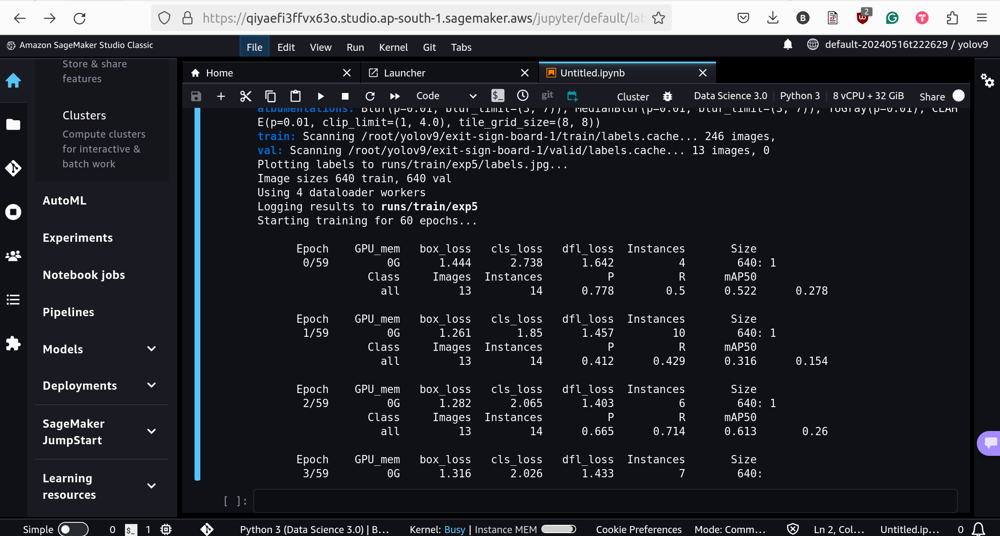

# Session 15 Assignment

## Problem Statement

* Go through this video Links to an external site.. [Link](https://www.youtube.com/watch?v=Opr53ctUVlA)
* Set up training of your v9 on Colab, making sure everything is ready
* Move training to AWS. 
* Download the model, and mode the model to HuggingFace, and deploy your Gradio app with couple of examples

What you need to share:

* Screenshot of your EC2 (or other cloud) training log
* Link to your GitHub Code
* Link to your Gradio App

## Training EC2 snapshot of logs

## 🎧 Gradio App
A user-friendly interface constructed using Gradio. This app enables users to upload images and help to detect Exit signboard.

[Link to Gradio App](https://huggingface.co/spaces/balajib197/eras15)
