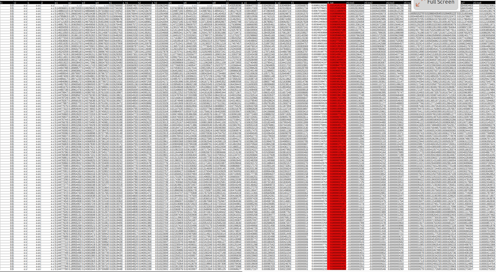
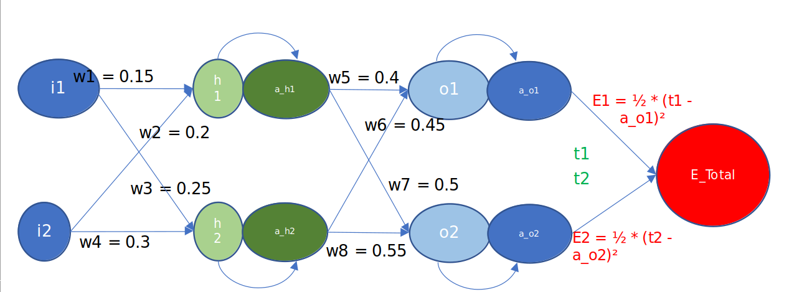

# Session6  

### PART 1  
Excel sheet explaining the backpropagation.  

Major steps followed while writing the excel for backpropagation.

1. t1 and t2 are the target 1 and target 2 which remains constant in the excel.  
2. i1 and i2 are inputs to the network, inputs in the network remains constant.  
3. h1 and h2 are the hidden layers connecting the input and the output with the respective weights.  
4. w1 and w4 are the weights connecting between i1 and i2 with the h1 and h2.  
5. w2 and w3 are the weights connecting between i2 and i1 with the h1 and h2.  
6. o1 and o2 are the output of the i1 and i2 they are connected with the hidden layers h1 and h2.
7. w5 and w8 are the weights connecting between h1 and h2 with the o1 and 02.
8. w6 and w7 are the weights connecting between h2 and h1 with the o2 and o1.
9. Weights are intialized with random value, in this case we have predifined it with a certain value to calculate the backpropagation.
10. a_h1 and a_h2 is the sigmoid of the h1 and h2.
11. a_o1 and a_o2 is the sigmoid of the o1 and o2.
12. E1 and E2 are the error value of the i1 and i2 with the hidden layer h1 and h2.
13. E_total is the sum of E1 and E2, where the derivativate of E_total wrt w1, w2, w3, w4, w5, w6, w7, and w8 is calculated using the backpropagation to adjust the weights value so that the loss will be minimum and a_o1, a_o2 will be very close to t1 and t2 value.

#### Lets use the equations to calculate the new weights for every iteration.

Refering the network image  
 h1 = w1 \* i1 + w2 \* i2    <- *hidden layer 1*  
 h2 = w3 \* i1 + w4 \* i2  <- *hidden layer 2*  
 a_h1 = σ(h1) = 1/(1 + exp(-h1))  
 a_h2 = σ(h2)  
 o1 = w5 \* a_h1 + w6 \* a_h2  
 o2 = w7 \* a_h1 + w8 \* a_h2  
 a_o1 = σ(o1)  
 a_o2 = σ(o2)  
 E_total = E1 + E2  <- Total error  
 E1 = ½ \*  (t1 - a_o1)²  <- Error for input 1 (i1)  
 E2 = ½ \*  (t2 - a_o2)²  <- Error for input 2 (i2)  
 
### consider the below equation to solve the backpropagation  
∂E_total/∂w5 = ∂(E1 + E2)/∂w5  
 the equation represents the derivative of E_total wrt w5, and this can rewritten as below considering E2 has no contribution for calculating the w5 wrt E_total.  
 So, ∂E_total/∂w5 = ∂E1/∂w5  
 Now
 ∂E_total/∂w5 = ∂E1/∂w5 = ∂E1/∂a_o1*∂a_o1/∂o1*∂o1/∂w5  
 we just re-written using the partial derivative formula.

 Now solve the equation:  
 ∂E1/∂a_o1 = ∂(½ * (t1 - a_o1)²)/∂a_o1 = (a_01 - t1)  
 ∂a_o1/∂o1 =  ∂(σ(o1))/∂o1 = a_o1 * (1 - a_o1)  
 ∂o1/∂w5 = a_h1

 Now the derivatives are:  
 ∂E_total/∂w5 = (a_01 - t1) * a_o1 * (1 - a_o1) *  a_h1  
 ∂E_total/∂w6 = (a_01 - t1) * a_o1 * (1 - a_o1) *  a_h2  
 ∂E_total/∂w7 = (a_02 - t2) * a_o2 * (1 - a_o2) *  a_h1  
 ∂E_total/∂w8 = (a_02 - t2) * a_o2 * (1 - a_o2) *  a_h2  

 ∂E1/∂a_h1 = (a_01 - t1) * a_o1 * (1 - a_o1) * w5  
 ∂E2/∂a_h1 = (a_02 - t2) * a_o2 * (1 - a_o2) * w7  
 ∂E_total/∂a_h1 = (a_01 - t1) * a_o1 * (1 - a_o1) * w5 +  (a_02 - t2) * a_o2 * (1 - a_o2) * w7  
 ∂E_total/∂a_h2 = (a_01 - t1) * a_o1 * (1 - a_o1) * w6 +  (a_02 - t2) * a_o2 * (1 - a_o2) * w8  

 5 solve  
 ∂E_total/∂w1 = ∂E_total/∂a_h1 * ∂a_h1/∂h1 * ∂h1/∂w1  
 ∂E_total/∂w2 = ∂E_total/∂a_h1 * ∂a_h1/∂h1 * ∂h1/∂w2  
 ∂E_total/∂w3 = ∂E_total/∂a_h2 * ∂a_h2/∂h2 * ∂h2/∂w3  

 6 solve  
 ∂E_total/∂w1 = ((a_01 - t1) * a_o1 * (1 - a_o1) * w5 +  (a_02 - t2) * a_o2 * (1 - a_o2) * w7) * a_h1 * (1 - a_h1) * i1  
 ∂E_total/∂w2 = ((a_01 - t1) * a_o1 * (1 - a_o1) * w5 +  (a_02 - t2) * a_o2 * (1 - a_o2) * w7) * a_h1 * (1 - a_h1) * i2  
 ∂E_total/∂w3 = ((a_01 - t1) * a_o1 * (1 - a_o1) * w6 +  (a_02 - t2) * a_o2 * (1 - a_o2) * w8) * a_h2 * (1 - a_h2) * i1  
 ∂E_total/∂w4 = ((a_01 - t1) * a_o1 * (1 - a_o1) * w6 +  (a_02 - t2) * a_o2 * (1 - a_o2) * w8) * a_h2 * (1 - a_h2) * i2  
 
 
 
 
 

