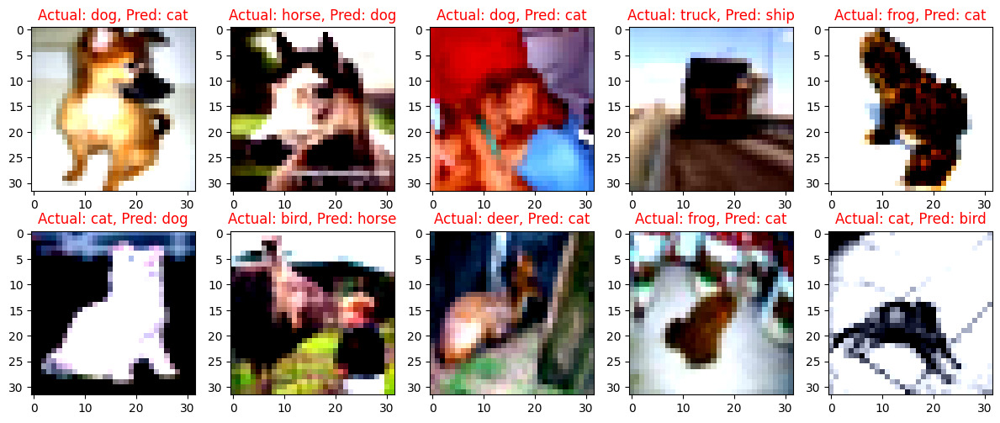
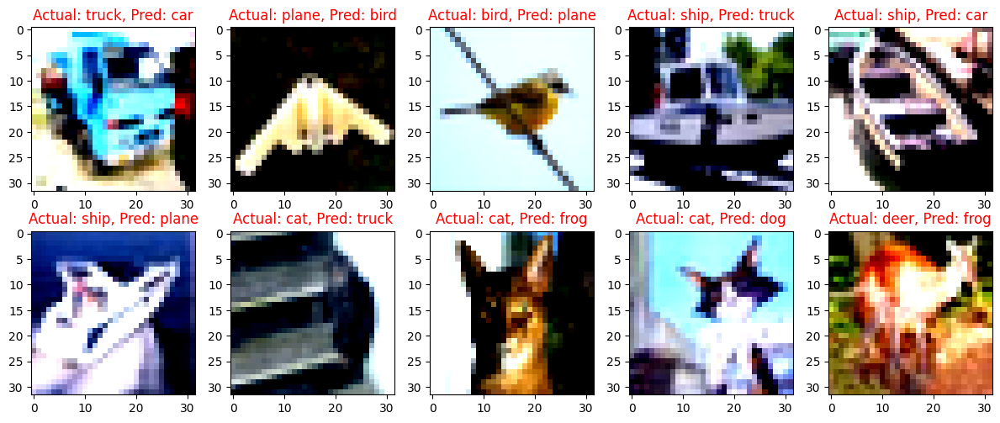
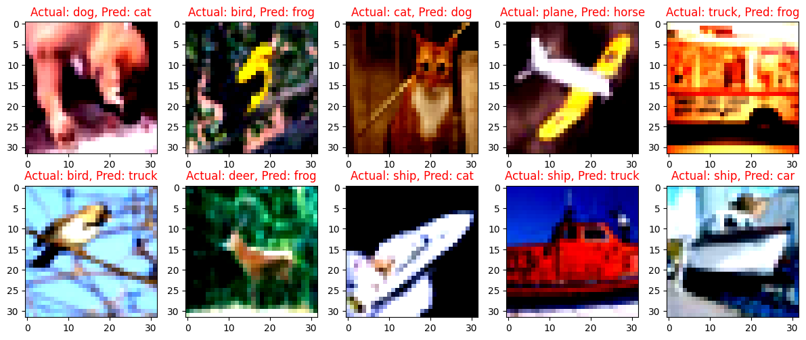
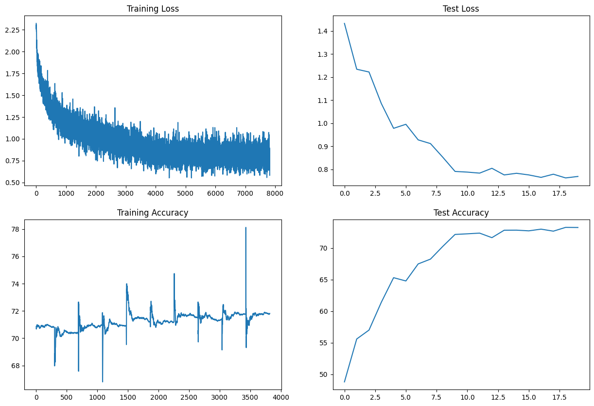
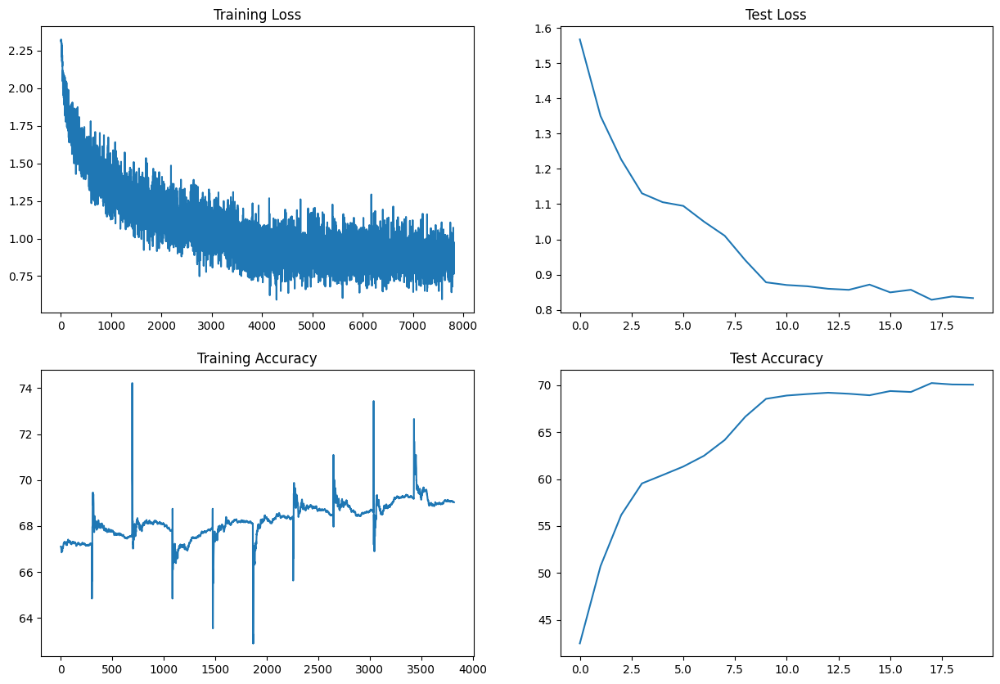
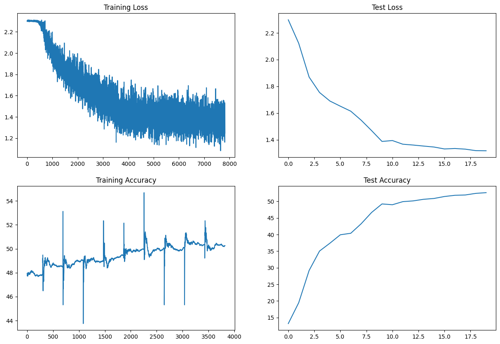

# ERAV2 Session 8 Assignment

Assignment is:
1. Change the dataset to CIFAR10  
2. Make this network:  
    1. C1 C2 c3 P1 C3 C4 C5 c6 P2 C7 C8 C9 GAP c10  
    2. Keep the parameter count less than 50000  
    3. Try and add one layer to another  
    4. Max Epochs is 20  
3. You are making 3 versions of the above code (in each case achieve above 70% accuracy):  
    1. Network with Group Normalization  
    2. Network with Layer Normalization  
    3. Network with Batch Normalization  
4. Share these details  
    1. Training accuracy for 3 models  
    2. Test accuracy for 3 models  
    3. Find 10 misclassified images for the BN model, and show them as a 5x2 image matrix in 3 separately annotated images.  
5. write an explanatory README file that explains:
    1. what is your code all about,
    2. your findings for normalization techniques,
    3. add all your graphs
    4. your collection-of-misclassified-images 
6. Upload your complete assignment on GitHub and share the link on LMS

## 📖 Introduction

The goal of this assignment is to implement and evaluate the performance of a Convolutional Neural Network (CNN) with different normalization techniques on the CIFAR10 dataset. The network has a specific architecture (C1 C2 c3 P1 C3 C4 C5 c6 P2 C7 C8 C9 GAP c10 ) with the total parameter count kept under 50,000. "C" means 3x3 convoluion, "c" means 1x1 convolution, "P" means max pooling and "GAP" means global avaerag pooling. Network with skip connections.

Three versions of the network are created, each applying a different normalization technique: Group Normalization (GN), Layer Normalization (LN), and Batch Normalization (BN). Each model is trained for 20 epochs, and the goal is to achieve an accuracy of above 70% for each model.

The CIFAR10 dataset consists of 60,000 32x32 color training images and 10,000 test images, labeled into 10 classes. The 10 classes represent airplanes, cars, birds, cats, deer, dogs, frogs, horses, ships, and trucks. The dataset is divided into 50,000 training images and 10,000 validation images.

## 📓 Notebook and Results

Below is a table summarizing the performance of each model. It provides links to the notebooks for each model, along with their respective training and test accuracies.

| Model | Notebook Link | Training Accuracy | Test Accuracy |
|-------|---------------|-------------------|---------------|
| Batch Normalization | [BN Notebook](./ERA2S8F_BN.ipynb) | 71.82 % | 73.24 % |
| Group Normalization | [GN Notebook](./ERA2S8F_GN.ipynb) | 69.19 % | 70.24 % |
| Layer Normalization | [LN Notebook](./ERA2S8F_LN.ipynb) | 50.37 % | 52.64 % |

## 📸 Misclassified Images

### Batch Norm
Few Samples of misclassified images,  

### Group Norm

Few Samples of misclassified images,  

### Layer Norm

Few Samples of misclassified images,  

## 📸 Train metrics

### Batch Norm

### Group Norm

### Layer Norm

